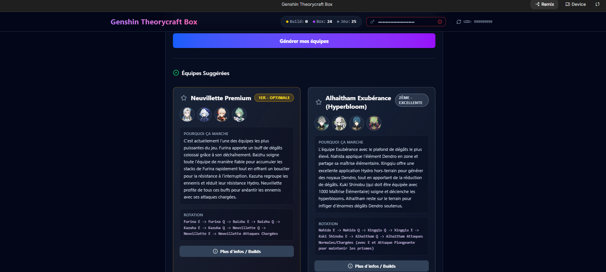
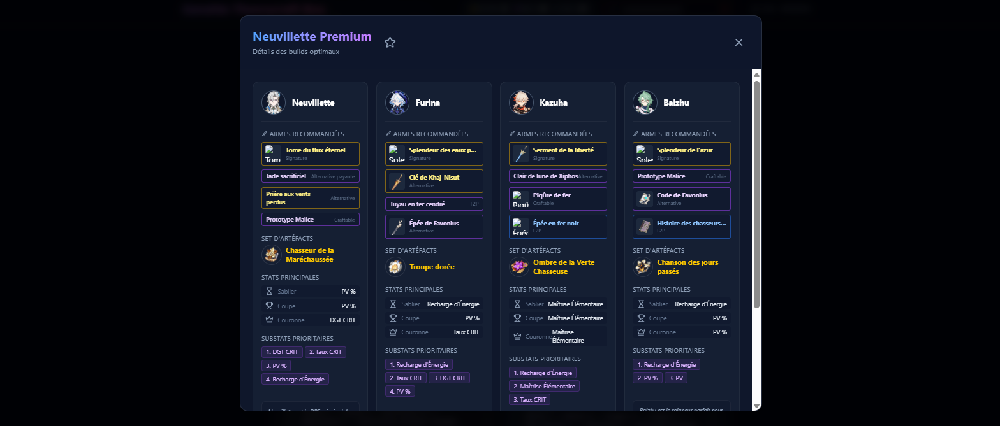

# Genshin AI Theorycrafter


**Genshin AI Theorycrafter** est une application web React novatrice conçue pour aider les joueurs de Genshin Impact à optimiser leur compte de manière intelligente. En synchronisant la "box" d'un joueur via l'API Enka Network, l'application génère des compositions d'équipes sur-mesure et des builds optimisés grâce à l'IA Gemini de Google, couplée à un puissant système RAG (Retrieval-Augmented Generation) 100% local.

---

## ✨ Fonctionnalités Principales

### 🔄 Importation Dynamique de Compte (Enka Network)
Fini la saisie manuelle interminable. Entrez simplement votre UID Genshin Impact, et l'application récupérera automatiquement les statistiques, les armes, les artéfacts et l'avancement de vos personnages mis en "Vitrine" via l'API Enka Network.

 <!-- Placeholder d'import -->

### 🧠 Système d'IA Fiabilisé par RAG Local
L'IA ne devine pas, elle sait. Le projet embarque une base de données de connaissances vectorielle locale (RAG) ultra-légère regroupant toutes les données mathématiques et mécaniques officielles de plus de 100 personnages. **Fini les hallucinations : l'IA base son theorycrafting sur les vraies descriptions des compétences, passifs et constellations du jeu.**

### ⚔️ Génération d'Équipes Intelligentes (JSON)
À partir d'une simple requête textuelle (ex: *"Fais-moi la meilleure équipe pour les Abysses actuelles autour de Mualani"*), l'application analyse votre box et propose **les 4 meilleures options d'équipes**. Elle vous fournit les synergies exactes et les rotations idéales, le tout formaté via un parseur JSON strict.

 <!-- Placeholder d'équipe -->

### 🛡️ Optimisation des Builds Recommandés
Un clic sur une équipe générée suffit à ouvrir une modale de théorie détaillée. L'IA vous fournira instantanément les meilleurs sets d'artéfacts, les statistiques à privilégier (Coupe/Sablier/Couronne) ainsi que le Top 4 des meilleures armes (5★, 4★, F2P, Craftables) pour chaque personnage sélectionné.

 <!-- Placeholder de build -->

### 🌐 Interface Multilingue Assistée par l'IA
Grâce à un sélecteur animé dans l'interface de chat, vous pouvez dicter la langue de réponse de l'IA (Français, Anglais, Allemand, Espagnol, Italien, etc.) à la volée, permettant de s'adapter aux préférences de n'importe quel joueur.

### 🛡️ Résilience Réseau et UX Fluide
Le service Gemini intègre un intercepteur d'erreurs robuste. Si les serveurs mondiaux de Google sont surchargés (Erreur 503) ou si les limites de l'API gratuite sont atteintes (Erreur 429), l'application bloque les animations de chargement infinies et affiche un message clair à l'utilisateur, blâmant poliment l'infrastructure serveur. 

---

## 🚀 Lancement du projet en local

### 1. Prérequis
- **Node.js** (version 18+ recommandée)
- Une clé API gratuite [Google Gemini](https://aistudio.google.com/app/apikey)

### 2. Installation
Clonez ce dépôt puis installez les dépendances :
```bash
git clone <votre-url-de-depot>
cd GenshinProject
npm install
```

### 3. Configuration
Créez un fichier `.env` à la racine de votre projet ou utilisez l'interface applicative (Menu Paramètres) pour renseigner votre clé Gemini.
Si `.env`, ajoutez :
```env
VITE_GEMINI_API_KEY=votre_cle_api_ici
```

### 4. Démarrage du serveur de développement
```bash
npm run dev
```
Rendez-vous sur [http://localhost:5173](http://localhost:5173) pour utiliser l'application.

---

## 🛠️ Maintenance & Mise à jour (Script RAG)
À **chaque nouveau patch de Genshin Impact**, de nouveaux personnages sortent. Pour que l'IA reste experte, vous devez mettre à jour la base RAG locale.
Il vous suffit de lancer notre script Node.js dédié situé dans le dossier `scripts/` :

```bash
# Génère ou met à jour src/data/rag-database.json de façon performante
node scripts/build-rag.js
```
*(Note : Ce script convertit les centaines de fichiers JSON lourds contenant le lore et certaines voix du jeu en une base ultra-légère et concentrée sur l'information Theorycraft : Descriptions des talents et passifs nettoyées des balises HTML).*

---

## 💻 Stack Technique
Ce projet a été construit avec les technologies modernes suivantes :
- **Framework Global :** React (Vite.js)
- **Langage & Typage :** TypeScript (TS / TSX)
- **Stylisation UI & Layouts :** Tailwind CSS
- **Intelligence Artificielle :** Google Generative AI SDK (`@google/genai`)
- **Icônes dynamiques :** Lucide React
- **Gestion des API tierces :** Enka Network (Synchronisation In-Game)
- **Traitements locaux (Serverless RAG) :** Node.js avec modules ES (FS & Path)
